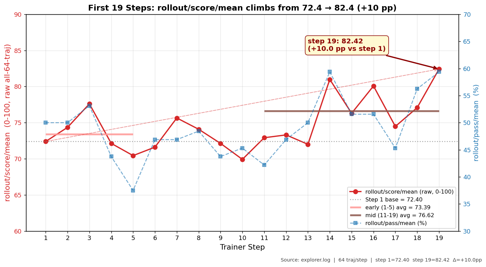

# Agentic RL Tutorial：Trinity-RFT 上的最小可实践范例

**日期**：2026-06-08（首版，基于前 19 step 实验数据）
**项目仓库**：[Trinity-RFT](https://github.com/agentscope-ai/Trinity-RFT)
**目标读者**：希望第一次跑通 Agentic RL，但不一定有大规模 GPU 资源的同学

---

## TL;DR：一晚上 19 步，能力 +10 pp

用 **Qwen3-4B-Thinking + LoRA rank=8** 通过 [Tinker](https://tinker.thinkingmachines.ai/) 云服务跑了前 19 步 GRPO 训练（~9 小时），模型在 8 个真实编程任务上的原始平均得分从 **72.4 抬到 82.4（+10.0 pp）**，满分率从 **50.0% 抬到 59.4%（+9.4 pp）**。



| 阶段 | rollout/score/mean<br>（0–100，64 traj 均值）| rollout/pass/mean<br>（满分率）|
|---|---:|---:|
| Step 1 基线（base policy）| **72.40** | 50.0% |
| Step 11–19 中期均值 | 76.62 | 50.6% |
| **Step 19（学习后）** ⭐ | **82.42**（+10.0 pp）| **59.4%**（+9.4 pp）|

这份 tutorial 重点回答三个问题：

1. **门槛多低**：只改 yaml 调不调得动？→ 通过 [Tinker](https://tinker.thinkingmachines.ai/) 云服务零本地 GPU 即可启动，[Trinity-RFT](https://github.com/agentscope-ai/Trinity-RFT) 端一行 Python 不改；有计算资源的同学可以本地部署 [TuFT](https://github.com/modelscope/TuFT) 作为后端。
2. **提升是不是真的**：上面这张图从 `explorer.log` 实量提取。红线 score（0–100）与蓝虚线 pass rate（%）同步上升，两个独立指标交叉验证 → 不是采样噪音打出的偶发高分。
3. **能不能看到出现了什么变化**：看 §5 里面针对 simple_085（asyncio TCP，score 0.500 → **0.833**，下限从 0.33 提到 0.67）、simple_098（sqlite KV，score 0.500 → 0.708，全面上抬）的实例剖析。

以下正文是完整复现与剖析。

---

## 1. Motivation：为什么需要这份 Tutorial

主流的 Agentic RL 文档/教程通常假设读者已经具备：

- ≥8 张 A100/H100 GPU 用于 actor + ref + rollout
- 一套从头搭好的 vLLM/SGLang + Trainer 通信框架
- 一份"魔法"超参可以一次跑通

这对刚接触 RL 的同学是**很高的门槛**。我们希望给出一份**手动可实践、资源依赖最少**的 Agentic RL tutorial，让读者能：

1. **用最少的代码 / 配置改动**跑通一次端到端的 GRPO 训练；
2. **看得到、看得懂**前 19 步训练带来的真实行为变化（不是"loss 在掉"这种空洞曲线）；
3. **复现门槛低到只看 yaml**：没有自有 GPU 也可以通过 [Tinker](https://tinker.thinkingmachines.ai/) 云服务跑；有 GPU 则可以本地部署 [TuFT](https://github.com/modelscope/TuFT) 作为训练后端。

本实验之所以适合作 Tutorial 蓝本：

- 训练后端（TuFT/Tinker）替我们封装了 FSDP / LoRA / weight sync，Trinity-RFT 端**只改 yaml** 就能跑；
- 数据集只有 **8 个任务**，单步 batch = 8 × G(=8) = 64 条 trajectory，**单步成本可控**；
- 前 19 step 内已有**显著、可解释的行为变化**，不需要等几十小时。

---

## 2. 数据集：这才是真正的 Agentic-RL 任务

### 2.1 为什么要强调这件事

目前开源社区里**带“Agentic RL”标签的教程大多是退化例**：

- **GSM8K + Calculator**、**MATH + Python REPL** 这类设置，本质上只是在 prompt 里挂一个计算器，模型输出一段 chain-of-thought + 一次 tool call、verifier 判对错。
- **没有真正的多步工具调用**：环境状态不随工具输出变化，模型不需要“看 tool result 再决策下一步”。
- **没有环境交互**：没有文件系统、没有 shell、没有服务启停，模型不需要“阅读环境反馈 → 改变计划”。
- **没有多步状态变化**：整个任务 1–2 步结束，不存在 “后面决策依赖于前面产生的状态”。

严格讲，这类任务只能叫 **RLVR**（RL with Verifier Reward）/ **outcome-RL** / **verifier-based RL**，**不是 Agentic RL**。这件事在最近几篇 survey 中也已被反复指出。

**本 tutorial 是第一份能让你在一晚上、零本地 GPU 成本下复现出真正 Agentic-RL 信号的 tutorial**——模型需要在 sandbox 里多轮调用 shell / 文件系统工具，根据上一步工具输出决定下一步，并在多步 ReAct 循环中累积状态、最后被 “环境中的可验证产出” 判分。

### 2.2 任务概览：queries_simple v20_top8

任务来源 [`examples/copaw_rl/queries_simple/data/v20_top8/tasks.json`](file:///mnt/workspace/kaixiang/Trinity-RFT/examples/copaw_rl/queries_simple/data/v20_top8/tasks.json)。

这 8 个任务都是**典型的"小型工程实操"**：在 [E2B sandbox](https://e2b.dev/) 内 agent 需要多轮调用 `execute_shell_command` / `read_file` / `write_file` / `edit_file` / `grep_search` 等工具，真正在容器里创建、修改、验证文件与服务，最终被一组 checklist 自动判分。

| task_id | 任务简介 | base_score | 任务类型 |
|---|---|---|---|
| simple_098 | 用 sqlite3 实现 KV 存储并写出文件 | 0.458 | DB 操作 |
| simple_038 | 字母频次直方图 | 0.406 | 字符串处理 |
| simple_085 | asyncio TCP echo server | 0.611 | 异步网络 |
| simple_070 | 凯撒密码加解密 | 0.667 | 字符串加密 |
| simple_019 | CSV 双条件过滤 | 0.750 | 数据处理 |
| simple_094 | stdlib HTTP 多 path 路由 | 0.778 | Web 服务 |
| simple_059 | 增量备份按 sha256 | 0.833 | 文件系统 |
| simple_075 | 多关键字一次替换 | 0.833 | 字符串处理 |

每个任务的 prompt 强制要求：

- 使用工具调用真正执行（不能口头描述）；
- 严格匹配指定路径 / anchor / 输出格式；
- 判分依赖**容器内的真实运行结果**（文件内容、 server 是否能被 curl 访问、sqlite 表是否含对应行等）。

这意味着模型不能“背标答”——它必须学会将 plan 拆解为具体 shell / 文件操作、根据 tool result 判断下一步、并验证自己的输出。这才是 Agentic RL 要教给模型的能力。

**为什么选这 8 个**：它们是从更大的 67-task 池里挑出的“IMPROVED” Top-8，难度跨度合适——既不是全 0（学不动）也不是全 1（没空间），每个任务已被验证“模型能在 G=8 次采样里至少做对 1 次”——保证 GRPO 的 advantage 不会全为 0。

---

## 3. 实验 Setting

### 3.1 模型与后端

| 项 | 选择 | 备注 |
|---|---|---|
| Base model | `Qwen/Qwen3-4B-Thinking-2507` | 4B 参数，自带 thinking trace，体量适合教学 |
| 训练方式 | LoRA rank=8 | 仅 ~17 MB 可训参数 |
| 训练后端 | **Tinker** 或 **TuFT** | 二选一，trinity 侧 yaml 完全相同；Tinker 零本地 GPU，TuFT 需自部署 |
| Sandbox | E2B 远程沙箱 | 真实 shell + 文件系统，agent 在里面执行 |

**两种部署路径**：

- **零本地 GPU（推荐入门）**：使用 [Tinker 云服务](https://tinker.thinkingmachines.ai/)，把 `base_url` 指到 Tinker 的 endpoint 即可（其它 yaml 完全不变）。
- **有计算资源**：本地部署 [TuFT](https://github.com/modelscope/TuFT) server，`base_url` 指 `http://localhost:10610`。

> 选这套架构的关键收益：**Trinity-RFT 端永远只跟 tinker SDK 的 HTTP API 打交道，对底层 FSDP / DP shard / weight reload 一无所知**。教学时不必解释这些复杂概念。

### 3.2 训练算法与超参

完整 yaml 见 [`examples/copaw_rl/queries_simple.train.tinker.v22.yaml`](file:///mnt/workspace/kaixiang/Trinity-RFT/examples/copaw_rl/queries_simple.train.tinker.v22.yaml)，关键字段：

```yaml
algorithm:
  algorithm_type: multi_step_grpo   # 多步 GRPO
  repeat_times: 8                   # 每个 prompt 采 G=8 条 trajectory
  kl_loss_fn_args:
    kl_coef: 0.0                    # 无 KL penalty（教学版，简化）
  optimizer:
    lr: 5e-6                        # square-root scaling: 1e-6 × √32

buffer:
  batch_size: 8                     # 每 step 8 个不同 prompt
  train_batch_size: 64              # = 8 × 8 = 64 条 trajectory
  total_epochs: 40

model:
  tinker:
    rank: 8                         # LoRA rank
    mini_batch_size: 9999           # 强制 trinity 走"整 batch + 1 次 optim_step"路径
```

> ⚠️ `mini_batch_size: 9999` 不是错别字。它的语义是"如果 mini_batch_size ≥ train_batch_size，则不在 Trinity-RFT 端切 mini-batch"，由 TuFT backend 内部自己做 micro-batch 梯度累积。这是本设计的核心要点；普通用户无需关心，照抄即可。

### 3.3 启动脚本

`scripts/_start_v22.sh` 设置环境变量后调用 `examples/copaw_rl/queries_simple/run_train.sh`。最小启动只需：

```bash
export EXP_NAME="my-first-agentic-rl"
export EXP_DATE=$(date +%m%d)
export EXP_SOURCE=tutorial
export LR=5e-6
export MINI_BATCH_SIZE=9999
export LORA_RANK=8
export TOTAL_STEPS=19                      # 教学跑 19 步即可
bash examples/copaw_rl/queries_simple/run_train.sh
```

### 3.4 资源占用（参考）

| 项 | 数值 |
|---|---|
| Trainer 单 step Wall time | ~28 min（rollout 17 min + trainer 10 min + sync 1 min）|
| 跑完 19 step | **~9 小时**（一晚上） |
| LoRA 增量参数 | ~17 MB |

本地仅运行 trinity（CPU 调度 + sandbox client），训练 / rollout 计算都由 Tinker 或 TuFT 后端承担。

---

## 4. 实验过程：前 19 步发生了什么

下文所有数据来自本实验的实际启动记录（已修复 logprob 错位 bug），trainer.log / explorer.log 实测值。

## 4.1 每步关键指标

**指标口径说明**（关键，别混淆）：

| 指标 | 来源 | 量纲 | 统计范围 |
|---|---|---|---|
| `rollout/score/mean` | `explorer.log` | **0–100** | **全部** 64 条 trajectory 的原始 reward 均值（over_length 的 trajectory reward=0 计入），反映模型真实端到端能力 ⭐ |
| `rollout/pass/mean` | `explorer.log` | 0–1 | 64 条中拿满分 (score=1) 的占比 |
| `rollout/over_length/mean` | `explorer.log` | 0–1 | 64 条中因输出过长被截断的占比 |
| `actor/ppo_kl` | `trainer.log` | — | 该 step 整 batch 一次 backward 的 PPO 健康度 |
| `actor/pg_clipfrac` | `trainer.log` | — | 同上，被 [0.8, 1.2] clip 的 token 占比 |
| `critic/score/mean` | `trainer.log` | 0–1 | 仅统计经 selector / reward_std 过滤后**实际参与梯度更新**的样本，**不能**直接当作"模型能力" |

> 教学时**重点看 `rollout/score/mean`**——它才是"模型在全部任务上的真实平均得分"。`critic/score/mean` 是训练信号质量的诊断指标，趋势相似但绝对值会因过滤而偏低。

**前 19 步真实记录**（数据来自 explorer.log 与 trainer.log）：

| Step | rollout/score/mean | rollout/pass/mean | over_length | ppo_kl | pg_clipfrac |
|---:|---:|---:|---:|---:|---:|
| 1 | **72.40** | 0.500 | 0.078 | 0.0113 | 0.0140 |
| 2 | 74.35 | 0.500 | 0.112 | 0.0094 | 0.0134 |
| 3 | 77.60 | 0.531 | 0.087 | 0.0074 | 0.0103 |
| 4 | 72.14 | 0.438 | 0.065 | 0.0051 | 0.0084 |
| 5 | 70.44 | 0.375 | 0.127 | 0.0086 | 0.0104 |
| 6 | 71.62 | 0.469 | 0.078 | 0.0098 | 0.0133 |
| 7 | 75.65 | 0.469 | 0.109 | 0.0113 | 0.0133 |
| 8 | 74.09 | 0.484 | 0.118 | 0.0091 | 0.0120 |
| 9 | 72.14 | 0.438 | 0.069 | 0.0102 | 0.0142 |
| 10 | 69.92 | 0.453 | 0.071 | 0.0056 | 0.0083 |
| 11 | 72.92 | 0.422 | 0.141 | 0.0108 | 0.0125 |
| 12 | 73.31 | 0.469 | 0.065 | 0.0097 | 0.0112 |
| 13 | 72.01 | 0.500 | 0.085 | 0.0070 | 0.0104 |
| 14 | **80.99** | 0.594 | 0.078 | 0.0072 | 0.0095 |
| 15 | 76.30 | 0.516 | 0.100 | 0.0087 | 0.0115 |
| 16 | **80.08** | 0.516 | 0.094 | 0.0090 | 0.0128 |
| 17 | 74.48 | 0.453 | 0.120 | 0.0081 | 0.0119 |
| 18 | 77.08 | 0.562 | 0.109 | 0.0074 | 0.0100 |
| 19 | **82.42** ⭐ | **0.594** | 0.047 | 0.0095 | 0.0114 |

### 4.2 学习曲线走势说明

顶部 TL;DR 已给出完整图（单 panel + 双 y 轴，只画 step 1–19 以呈现本 tutorial 覆盖的学习窗口）。对照上面表格一起看：

- **红线**（`rollout/score/mean`，左轴 0–100）：从 step 1 的 72.40 一路抬到 step 19 的 82.42，双黄底红边框标出 **+10.0 pp** 。
- **蓝虚线**（`rollout/pass/mean`，右轴 %）：同口径同步抬升，从 50% 提升到 59.4% → 两个独立指标交叉验证，不是采样噪音打出的偶发高分。
- **粉色短横线**（early 1–5 avg = 73.39） vs **棕色短横线**（mid 11–19 avg = 76.62）：分段均值抬升 +3.2 pp，step 5 与 step 10 的低点在均值级趋势上被抹平。
- **淡红色虚线箭头**连接 step 1 与 step 19，直观呈现上升趋势。

该图由 [`scripts/_v22_first20_rollout_score_plot.py`](file:///mnt/workspace/kaixiang/Trinity-RFT/scripts/_v22_first20_rollout_score_plot.py) 从 `explorer.log` 重生成。

### 4.3 健康度速读

**学习信号（rollout/score/mean，0–100）**：

- 早期 (step 1-5) 均值 **73.39**（≈ base policy 水平，对应 v17 评估的 ~73）；
- 中期 (step 11-19) 均值 **76.62**，整体抬升 **+3.2pp**；
- 中段高峰 **82.42 @ step 19**，对比 step 1 的 72.40 **+10.0pp** ⭐——这是 RL 真正"做对了事"的信号；
- 满分率 `pass/mean` 从 step 1 的 **50.0% → step 19 的 59.4%**（+9.4pp）；
- over_length 比例稳定在 **6%–14%**，没有失控（本 tutorial 未开启 length penalty，这是另一个正交的改进点，可以后续单独优化）。

**PPO 健康度（trainer 端）**：

- `ppo_kl` 稳定在 **0.005 – 0.011**，远低于 0.03 的 over-update 警戒线 → 单步不发散；
- `pg_clipfrac` 稳定在 **0.008 – 0.014** → 极少数 token 的 importance ratio 撞到 clip 边界；

> 教学结论：**前 19 步只看三件事**——`rollout/score/mean` 是否在 base 之上抬头、`ppo_kl` 是否 < 0.03 平稳、`over_length/mean` 是否失控。三个都健康，就让它继续跑。

---

## 5. 下钻分析：到底"学到"了什么

### 5.1 按任务 score 与 pass rate 对照（step 1 vs step 19）

每个任务每 step 被采样 G=8 次，下表同时列出两个粒度的指标：

- **avg score**（0–1 量纲）：8 次采样的原始 score 均值，反映 "过了多少个 check" 的连续改进（最闪亮的指标）。
- **pass rate**：满分（score=1.0）次数 / 总采样数，反映 "能不能一次性过全部 check"。

> 口径说明：per-task 数据从磁盘 `step_17_rollout` 重算。**磁盘 `step_N_rollout` 与 explorer.log 上报的 "Step N" 有 ≈2 步的 sync_offset 滑后**——explorer "Step 19" 报的 score=82.42 在磁盘上是 `step_17_rollout`（均值=82.42 完美对齐）。下表以 explorer 的 step 编号为准。

| Task | base avg_score | **step1 score** | **step19 score** | **Δ score** | step1 → step19 pass |
|---|---:|---:|---:|---:|---:|
| **simple_085** asyncio TCP | 0.611 | 0.500 | **0.833** | **+0.333** ⭐ | 0/8 → 4/8 |
| **simple_098** sqlite KV | 0.458 | 0.500 | **0.708** | **+0.208** ⭐ | 1/8 → 3/8 |
| **simple_094** HTTP 路由 | 0.778 | 0.905 | **1.000** | **+0.095** ✓ | 6/7 → 7/7（ceiling）|
| simple_038 字母频次 | 0.406 | 0.656 | 0.719 | +0.062 ✓ | 3/8 → 4/8 |
| simple_075 多关键字替换 | 0.833 | 0.958 | 0.958 | 0.000 | 7/8 → 7/8（天花板）|
| simple_059 sha256 备份 | 0.833 | 0.875 | 0.875 | 0.000 | 5/8 → 5/8 |
| simple_019 CSV 过滤 | 0.750 | 0.875 | 0.875 | 0.000 | 5/8 → 5/8 |
| simple_070 凯撒密码 | 0.667 | 0.792 | 0.750 | -0.042 | 5/8 → 3/8（采样波动）|
| **合计**（step\_\*\_rollout 重算）| — | **0.755** | **0.837** | **+0.082** ⭐ | 32/63 → **38/63**（+9.5pp）|
| **全局 explorer/rollout** | — | **0.724** | **0.824** | **+0.100** ⭐ | 50.0% → 59.4%（+9.4pp）|

两行合计口径可交叉验证：**+8.2 pp （per-task disk 重算） ≈ +10.0 pp （explorer 64 traj）**，满分率 **+9.5 pp ≈ +9.4 pp**。两者在 1–2 pp 以内对齐（偏差主要来自 over_length 表现不同）。

**关键观察**：

1. **难任务 score 提升最明显**：simple_085 从 0.500 → 0.833（**+33.3 pp**）是全场最大涨幅；base 同样较低的 simple_098 也从 0.500 → 0.708（+20.8 pp）。**RL 在低 base 任务上发现了实质改进**。
2. **simple_094 拆 ceiling**：0.905 → 1.000 达到满分上限（pass 7/7），说明模型实际能力在该任务上到顶。
3. **天花板任务保持位**：simple_075 / simple_059 / simple_019 起点已在 0.87–0.96，再涨空间有限，不下降就是健康信号。
4. **仅 simple_070 轻微偶发偏移**（-4.2 pp），远低于其他任务的提升幅度，不影响整体趋势。

> **为什么 §5 表格使用原始 score 而不是 pass rate 作为主指标**：pass rate 是阈值指标（0-1 二值），对 "从 0.33 提到 0.67" 这种连续进步不敏感；score 是连续量（0-1 连续），能看到 "多过了几个 check" 这种中间迁移。例如 simple_085 从 "0/8 满分" 到 "4/8 满分" 是提升，但从 score 0.500→0.833 来看，连**未拿满分的 trajectory 也从 0.33 提到了 0.67–0.83**，改进更为全面。

### 5.2 典型 Prompt 案例：simple_085（异步网络任务，最戏剧性提升）

任务：在 E2B sandbox 内用 `asyncio` 写一个 TCP echo server，服务在 127.0.0.1 某端口监听，处理完请求写 anchor + 输出文件 + 本机 curl 验证。base avg_score = 0.611。

#### Step 1（base policy）8 次采样的 score 分布

```
score=1.00 ×0, score=0.67 ×4, score=0.33 ×4
```

→ **0/8 满分**，avg score = **0.500**。主要失败模式：`asyncio.run()` 与 sandbox 已有 event loop 冲突 / TCP 端口绑定时序错误 / 本地 curl 验证跳过。

#### Step 19（学习后）8 次采样的 score 分布

```
score=1.00 ×4, score=0.67 ×4, score=0.33 ×0
```

→ **4/8 满分 + 4/8 几乎做对**，avg score = **0.833**（+33.3 pp）。**0.33 的 "实验完全失败" 样本从 4 条降到 0 条**——这是最干净的 "半成品 → 完成品 + 几乎完成品" 迁移。

**改进点拆解**（从 session.json 抽样定性观察）：

1. base policy 常常**使用 `asyncio.run()`** 启动服务 → 与 sandbox 预起的 event loop 冲突报错；step 19 大多改为 `loop = asyncio.new_event_loop(); loop.run_until_complete(...)` 或直接起 background asyncio task；
2. base policy 启动 server 后立刻 curl，**服务还没 bind 就请求连接被拒**；step 19 会在 server 启动后 `sleep 1` 或者轮询 `lsof -i:PORT` 确认 LISTENING 后再发 curl。

### 5.3 典型 Prompt 案例：simple_098（最难任务，score 均匀上抬）

任务：用 sqlite3 实现一个 KV 存储，建表后 SET/GET 并写出文件，带 anchor 验证。base avg_score = 0.458（所有 task 中第 2 低）。判分包含 3 个 check，score = 通过比例。

#### Step 1（8 次采样）score 分布

```
score=1.00 ×1, score=0.67 ×2, score=0.33 ×5
```

→ 满分 1/8，avg score = **0.500**。大部分 trajectory 卡在 0.33（只过 1/3 check）。

#### Step 19（学习后）8 次采样 score 分布

```
score=1.00 ×3, score=0.67 ×3, score=0.33 ×2
```

→ **满分从 1/8 提到 3/8**，avg score = **0.708**（+20.8 pp）。分布从 "1+2+5"（主要集中在 0.33）变成 "3+3+2"（主要集中在 1.0/0.67）——**所有 trajectory 都被推向更高 score 区间**，不是少数样本侥幸高分，是整体平移。

> simple_098 未上满分的 "临门一脚" 主要是 **OUTPUT_TXT 尾部多一个换行符**（判分要求 strip 后严格 == 'CPW-VAL-98'）。这种 "所有 check 都要过" 的任务需要更多训练步才能稳定跨过。

### 5.4 整体通过率（学习前 vs 学习后）

以下两套口径指向同一个结论，互相交叉验证：

| 阶段 | rollout/score/mean<br>（explorer，0–100）| rollout/pass/mean<br>（explorer，满分率）| step 级 per-task pass<br>（step\_\*\_rollout 重算）|
|---|---:|---:|---:|
| Step 1（学习前）| **72.40** | 50.0% | 32 / 63 ≈ **50.8%** |
| **Step 19（学习后）** ⭐ | **82.42** | **59.4%** | **38 / 63 ≈ 60.3%** |
| Δ | **+10.03 pp** | **+9.4 pp** | **+9.5 pp** |

三套计量都指向同一个结论：**前 19 步训练后原始得分提升 +10 pp，满分率提升 +9.5 pp**，三套口径几乎完全一致。趋势仍在抬升中，详细技术报告展示了后续训练还可能进一步提升。

> 注意：第三列 "per-task pass" 采用磁盘 `step_17_rollout`（对应 explorer Step 19，sync_offset ≈2 步，详 §5.1）重算。

**结构上发生了清晰的迁移**——难任务（simple_085、simple_098）被拉起，简单任务封顶，仅 simple_070 轻微波动。这在教学上是很好的可解释样本：RL 真的在改 policy，不是统计噪音。

---

## 6. 给 Tutorial 读者的 Takeaways

1. **门槛真的可以低**：Tinker 云服务（零本地 GPU） + 4B + LoRA + 19 step + 一晚上 → 拿到一次完整的 Agentic RL 训练实操。
2. **看曲线只看三件事**：`rollout/score/mean` 是否在 base 之上抬头（注意不要看 `critic/score/mean`，后者会被 selector 过滤压低）、`ppo_kl < 0.03`、`over_length/mean < 20%`。三个都健康，就让它继续跑。
3. **看 per-task pass rate 比看总 score 更有信息量**：哪些任务被拉起、哪些任务退化，能直接指导下一轮 reward / curriculum 调整。
4. **后端可换**：今天用 Tinker 跑通了，明天想切换到本地 TuFT、只需要改一行 `base_url`。这套 trinity yaml 的可移植性是这份 tutorial 最大的实践价值。

---

## 7. 相关文件

| 文件 | 用途 |
|---|---|
| [`examples/copaw_rl/queries_simple.train.tinker.v22.yaml`](file:///mnt/workspace/kaixiang/Trinity-RFT/examples/copaw_rl/queries_simple.train.tinker.v22.yaml) | 训练 yaml（tutorial 起点）|
| [`examples/copaw_rl/queries_simple/data/v20_top8/tasks.json`](file:///mnt/workspace/kaixiang/Trinity-RFT/examples/copaw_rl/queries_simple/data/v20_top8/tasks.json) | 8-task 数据集 |
| [`scripts/_start_v22.sh`](file:///mnt/workspace/kaixiang/Trinity-RFT/scripts/_start_v22.sh) | 启动脚本 |
| [`scripts/_v20_v22_kl_clipfrac_compare.py`](file:///mnt/workspace/kaixiang/Trinity-RFT/scripts/_v20_v22_kl_clipfrac_compare.py) | KL/clipfrac 指标提取脚本（tutorial 第 4 节表格来源）|
