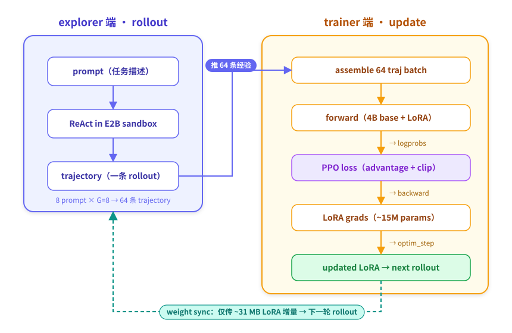

# 第 5 章：拆开黑盒 — 模型权重怎么更新的

> **本章模式：拆解**。第 4 章 advantage 算好了。这一章讲 advantage → 权重更新的最后一步：LoRA 省钱魔法、forward-backward 在后端的流程、以及让训练能稳定跑的关键 yaml 字段（`mini_batch_size: 9999`）。

---

## 5.0 完整流水线一张图



每步：64 traj 进 → forward → loss → backward → optim_step → 新 LoRA → 下一步 rollout。

---

## 5.1 LoRA：4B 模型 ~15M 参数（~31 MB）

全量微调 4B 模型需要约 **70 GB**（fp32 master + bf16 weight + grad + AdamW m/v）。LoRA 的做法：

```
base 矩阵:  W ∈ ℝ^(d×d)         (冻结)
LoRA 增量: ΔW = A · B            (只训这两个)
            A ∈ ℝ^(d×r)
            B ∈ ℝ^(r×d)
有效 weight = W + ΔW
```

`r` = rank。本教程 `r=8`，远小于 d=2560。

| 项 | 数量 |
|---|---|
| 全量微调一层一个矩阵 | d × d ≈ 6.55 M |
| LoRA 一层一个矩阵 | d × r + r × d ≈ 41 K（缩 160×）|
| **全模型 LoRA** | **15.4M params（~31 MB fp16）** |

base 4B 参数永远不动。每步 RL 真正在更新的就是这 ~31 MB。

> 你可以运行 `python scripts/tutorial/ch5_inspect_training.py --model Qwen/Qwen3-4B-Thinking-2507 --rank 8` 自己验证这个数字。

---

## 5.2 forward 仍要 4B 全模型

虽然只更新 LoRA，**forward 必须算 4B 全部 + LoRA 增量**——LoRA 是叠加在原矩阵上的，少不了。

trinity 把这个 forward 委托给训练后端：

```python
fb_future = await actor_client.forward_backward_custom_async(
    batch=64_trajectories,
    loss_fn=ppo_loss_fn,
)
opt_future = await actor_client.optim_step_async(adam_params)
```

后端内部：

1. 把 batch 切成 micro-batch（每 ~2 条 trajectory，避免 OOM）；
2. 对每个 micro-batch 跑 4B forward + LoRA 增量 → logprobs；
3. 客户端用 logprobs + old_logprobs + advantage 算 PPO loss → 反向到 LoRA；
4. 累积 micro-batch 梯度，最后**一次** optim_step 更新 LoRA。

trinity yaml 只关心两个字段：

```yaml
model:
  tinker:
    rank: 8
    mini_batch_size: 9999
```

---

## 5.3 关键细节：mini_batch_size 9999 的奥秘

trinity `tinker_trainer.train_step` 在 batch_size=64 时有两条路径：

| 路径 | 行为 | 触发条件 |
|---|---|---|
| **整 batch 一次更新** | 64 条 → 1 次 forward_backward → 1 次 optim_step | `mini_batch_size >= train_batch_size` |
| **mini-batch SGD** | 切成 N 个 mini-batch → 每个都 forward_backward + optim_step | `mini_batch_size < train_batch_size` |

**为什么本教程必须走整 batch**：

mini-batch SGD 模式有 **intra-step off-policy drift** 问题：

- 第 1 个 mini-batch：θ₀ 算 ratio，正常；
- 第 1 次 optim_step → θ₁；
- 第 2 个 mini-batch：仍用 θ₀ 算的 old_logprob，但 model 已经是 θ₁ → ratio 偏离 1；
- ... 第 32 个 mini-batch 时 ratio 严重偏离 → PPO clip 把信号截掉。

**解决方案**：设 `mini_batch_size: 9999`（>= 64）让 trinity 走整 batch 路径，1 次 forward_backward + 1 次 optim_step。后端内部仍切 micro-batch 累积梯度，但**只在最后做 1 次 optim_step**——梯度等价于整 batch SGD，没有 drift。

普通用户照抄 9999 即可。

---

## 5.4 AdamW 在做什么

```
m = β₁ · m_prev + (1 - β₁) · grad
v = β₂ · v_prev + (1 - β₂) · grad²
update = lr · m̂ / (√v̂ + ε)
weight_new = weight_old - update - lr · weight_decay · weight_old
```

本教程：

```yaml
optimizer:
  lr: 1e-6
  lr_scheduler_type: constant
  min_lr_ratio: 0.1
```

**lr=1e-6 怎么定的**：v22 时代曾用 square-root scaling 将 lr 从 1e-6 提到 5e-6（`1e-6 × √32 ≈ 5.66e-6`），但实测发现 5e-6 在后期容易出现 ppo_kl 抬升。后续实验（v31 起）退回 1e-6，配合 `kl_coef=0.01` 轻量约束，训练更稳定且复现更精准。

**lr 是最容易踩的坑**：

| 现象 | 原因 | 措施 |
|---|---|---|
| `ppo_kl > 0.03` 持续上升 | lr 太大 | 降到 3e-6 |
| score 完全不动 | lr 太小 | 升到 1e-5 |
| score 涨一会就崩 | 缺 KL penalty | 加 `kl_coef=0.001` |

---

## 5.5 weight sync 回 explorer

```yaml
synchronizer:
  sync_method: 'memory'
  sync_interval: 1
  sync_style: 'trainer_driven'
  wait_for_new_weights: true
```

LoRA + Tinker 配置下 sync 很快，因为只传 ~31 MB 增量。

---

## 5.6 完整一步训练的时间轴

```
t=0     explorer 开始 rollout 64 traj
          │ 17 min
t=17    rollout 完成 → 算 advantage → 推到 trainer
          │ 10 min
t=27    trainer 完成 forward_backward + optim_step
          │ 1 min
t=28    weight sync 完成（仅传 ~31 MB）→ 下一步开始
```

19 步 ≈ 9 小时。

---

## 5.7 动手试试

> 以下脚本从模型 config 精确计算 LoRA 参数量，同时展示训练配置和时间线。

```bash
# 用本地模型精确计算（只读 config.json，不加载权重，几秒完成）
python scripts/tutorial/ch5_inspect_training.py --model Qwen/Qwen3-4B-Thinking-2507 --rank 8

# 或用预计算数据（无需模型文件）
python scripts/tutorial/ch5_inspect_training.py --sample
```

---

## 5.8 这一章你应该带走的

✅ **LoRA 让 4B 模型只用 15M 参数（~31 MB）训练**：base 4B 永远冻结。
✅ **forward 仍要 4B 全模型**：trinity 委托给 Tinker/TuFT。
✅ **`mini_batch_size: 9999` 的由来**：避免 mini-batch SGD intra-step drift。
✅ **lr=1e-6 + AdamW + constant**：和整 batch 路径 + kl_coef=0.01 配套。
✅ **健康度三件套**：ppo_kl、pg_clipfrac、reward_std。

❌ **你不需要懂**：FSDP 多卡分片细节。

**留个问题**：你能从 reward → advantage → loss → gradient → weight 全链路走一遍。那如果改其中一个变量（比如加 KL penalty、换 G）曲线会怎么变？第 6 章带你动手做 ablation。

---

**上一章**：[第 4 章：GRPO advantage](./ch4_GRPO_advantage.md) ｜ **下一章**：[第 6 章：改黑盒做实验](./ch6_改黑盒做实验.md)
